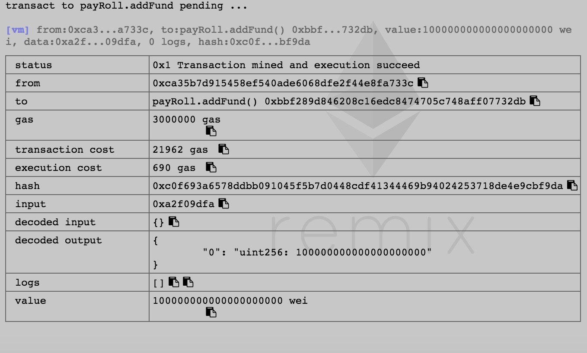
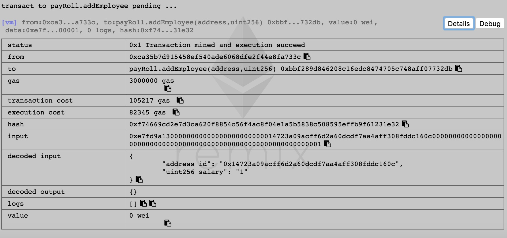
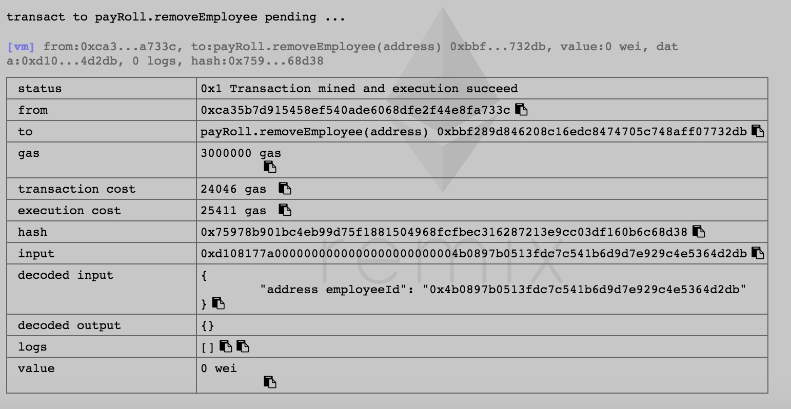
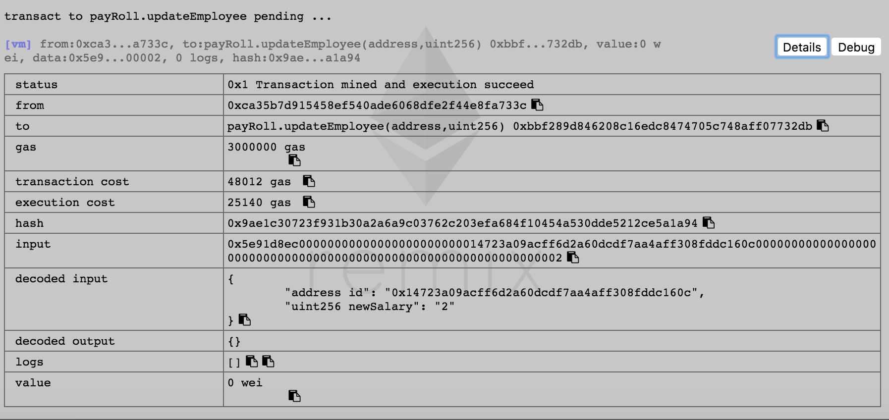
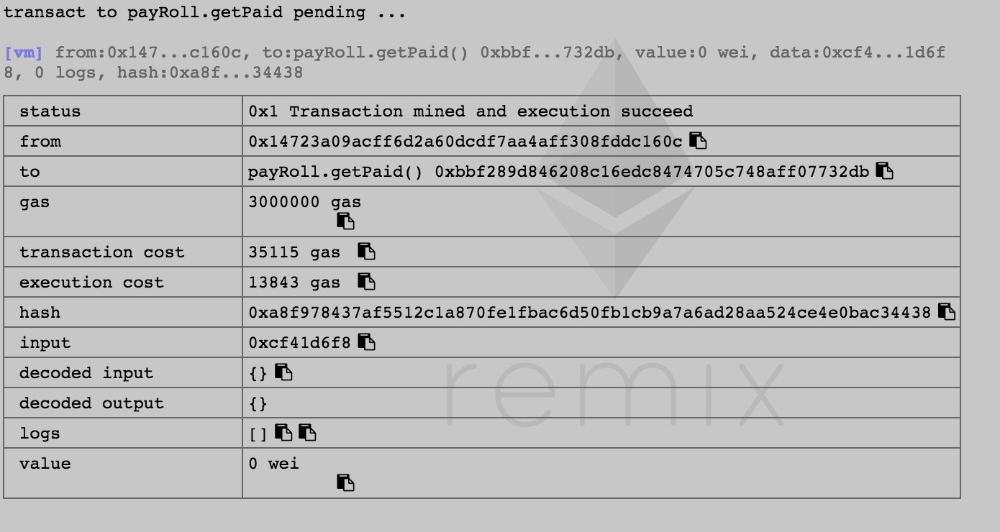
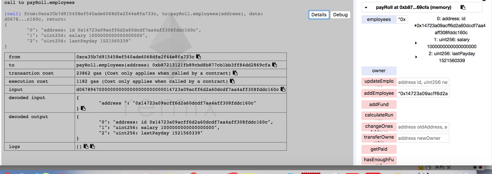
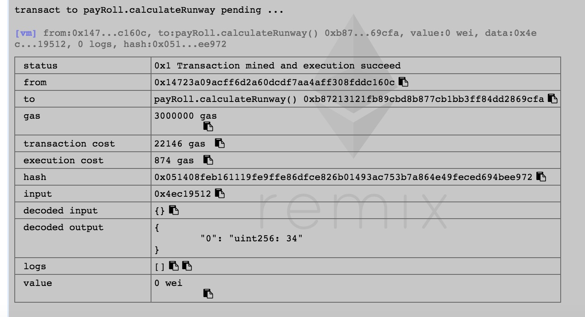
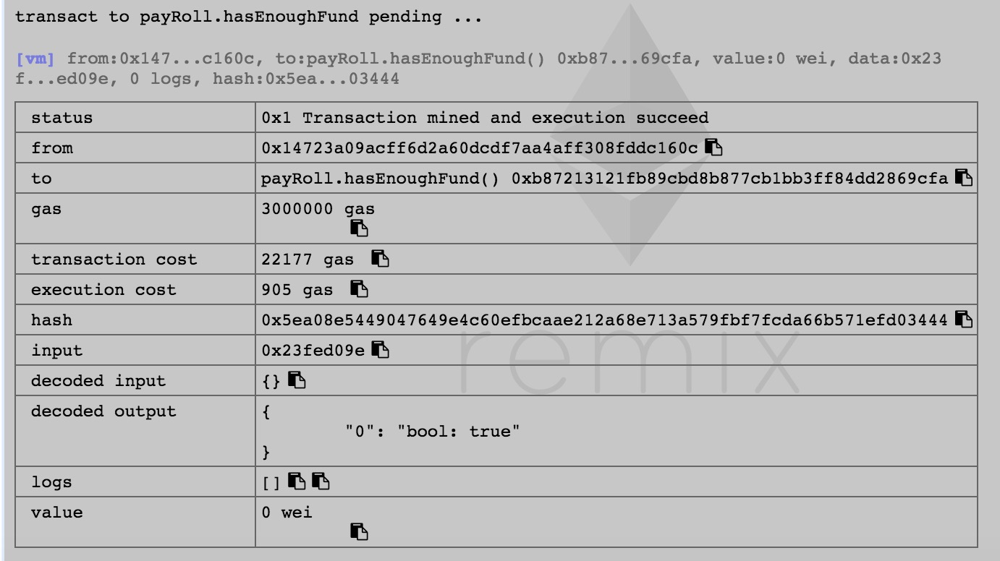
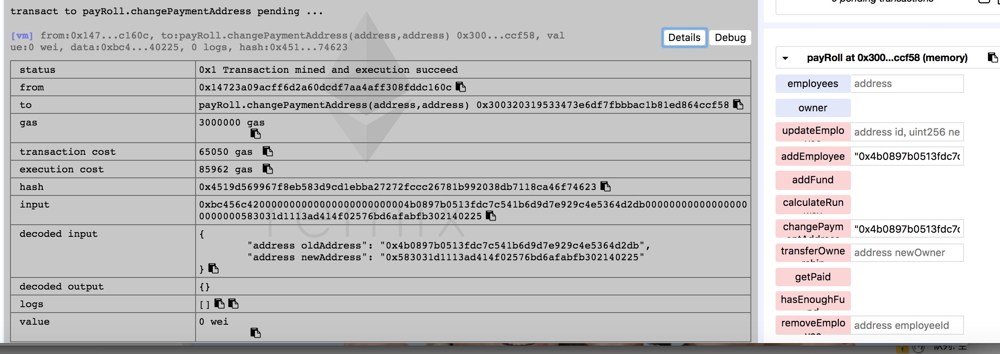

## 硅谷live以太坊智能合约 第三课作业

### 第三课：课后作业
- 第一题：完成今天所开发的合约产品化内容，使用Remix调用每一个函数，提交函数调用截图
    - addFund, 充值100ether;
    
        
        
    - addEmployee,添加员工，薪水1ether
        
    
    - removeEmployee,减员0x4b0897b0513fdc7c541b6d9d7e929c4e5364d2db
        
        
    - updateEmployee,更新员工 
        
    - getpaid,领工资
        
    - employees 查看员工
        
     - calculateRunway 
        
    - hasEnoughFund 
         
     - changePaymentAddress 更换员工地址
         
             
- 第二题：增加 changePaymentAddress 函数，更改员工的薪水支付地址，思考一下能否使用modifier整合某个功能
    - 增加两个modifier：hasNoEmployee、hasEmployee，详见yours.sol
    
    
- 第三题（加分题,尚未完成）：自学C3 Linearization, 求以下 contract Z 的继承线
- contract O
- contract A is O
- contract B is O
- contract C is O
- contract K1 is A, B
- contract K2 is A, C
- contract Z is K1, K2
